# Blockchain Based PKI Verification System


    
## Abstract

Our goal is to create a blockchain system for ensure keep anonymity safe and preserve 
user’s security. Security in this area gains importance as the developments in this area continue 
rapidly and it is thought that the financial flow of the future will flow over blockchain systems. 
Our purpose is to make a system that will be supported by a PKI based on this blockchain 
systems. In a short way, PKI for managing security through encryption. PKI certificates verify 
the owner of a private key and the authenticity of that relationship going forward to help 
maintain security. Our project uses that kind of security for protecting users’ identification 
information while they are using blockchain technologies and keep their anonymity safe. 
This project will bring innovation to this subject and combine the blockchain structure with 
PKI. With this structure, we will establish a system that is more suitable for everyone, meeting 
in the middle, while preserving its good aspects such as anonymity. 
Briefly, users who sharing their personal information with a third company by processing this 
shared information securely, a special signature is generated for users only. Being able to certify 
themselves with these produced signatures.


## Used Techonologies

**Front-End:** Dart, HTML, CSS, JavaScript

**Back-End:** SpringBoot, CRUD Structure, RestFulAPI

  
## APIs


```http
  GET /users
```

| Explanation                |
| :------------------------- |
| Returns all users.         |


```http
  GET /users/${id}
```

| Parameter | Type     | Explanation                |
| :-------- | :------- | :------------------------- |
| `id`      | `String` | Returns the user with specified id. |

```http
  GET /users/data/${id}
```

| Parameter | Type     | Explanation                |
| :-------- | :------- | :------------------------- |
| `id`      | `String` | Returns the user data information with specified id. |

```http
  GET /users/verification/${id}
```

| Parameter | Type     | Explanation                |
| :-------- | :------- | :------------------------- |
| `id`      | `String` | Returns the user verification information with specified id. |

```http
  GET /users/kyc/${id}
```

| Parameter | Type     | Explanation                |
| :-------- | :------- | :------------------------- |
| `id`      | `String` | Returns the user KYC information with specified id. |

```http
  GET /users/keypair/${id}
```

| Parameter | Type     | Explanation                |
| :-------- | :------- | :------------------------- |
| `id`      | `String` | Returns the user keypair information with specified id. |

```http
  GET /users/kyc/${id}
```

| Parameter | Type     | Explanation                |
| :-------- | :------- | :------------------------- |
| `id`      | `String` | Returns the user KYC information with specified id. |


```http
  GET /generate/keypair/${id}
```

| Parameter | Type     | Explanation                |
| :-------- | :------- | :------------------------- |
| `id`      | `String` | Generates keypair. |

```http
  GET /checkkycwithid/${id}
```

| Parameter | Type     | Explanation                |
| :-------- | :------- | :------------------------- |
| `id`      | `String` | Check user's KYC data with specified id. |

```http
  GET /findbywalletid/${walletid}
```

| Parameter | Type     | Explanation                |
| :-------- | :------- | :------------------------- |
| `walletid`      | `String` | Checks the signature is avaible for specified wallet_id. |

```http
  GET /walletverify/${id}
```

| Parameter | Type     | 
| :-------- | :------- | 
| `address`      | `String` | 
| `birthdate`      | `String` | 
| `firstname`      | `String` | 
| `lastname`      | `String` | 
| `kyc_id`      | `String` | 
| `gender`      | `String` | 
| `phonenumber`      | `String` | 
| `public_address`      | `String` | 


```http
  POST /subs
```

| Parameter | Type     | 
| :-------- | :------- | 
| `username`      | `String` | 
| `password`      | `String` | 

```http
  POST /auth
```

| Parameter | Type     | 
| :-------- | :------- | 
| `username`      | `String` | 
| `password`      | `String` | 
  
```http
  POST data/subs/${id}
```

| Parameter | Type     | 
| :-------- | :------- | 
| `firstname`      | `String` | 
| `lastname`      | `String` | 
| `country`      | `String` | 
| `phone`      | `String` | 

```http
  POST verification/subs/${id}
```

| Parameter | Type     | 
| :-------- | :------- | 
| `phoneVerification`      | `boolean` | 
| `emailVerification`      | `boolean` | 
| `kycVerification`      | `boolean` | 

```http
  POST data/subs/${id}
```

| Parameter | Type     | 
| :-------- | :------- | 
| `firstname`      | `String` | 
| `lastname`      | `String` | 
| `country`      | `String` | 
| `phone`      | `String` | 

```http
  POST kyc/subsphoto/${id}
```

| Parameter | Type     | 
| :-------- | :------- | 
| `file`      | `MultipartFile` | 
| `address`      | `String` | 
| `birthdate`      | `String` | 
| `file_2`      | `MultipartFile` | 
| `file_3`      | `MultipartFile` | 
| `firstName`      | `String` | 
| `lastName`      | `String` | 
| `identityNumber`      | `String` | 
| `gender`      | `String` | 
| `phoneNumber`      | `String` | 

```http
  POST users/createsignature/${id}
```

| Parameter | Type     | 
| :-------- | :------- | 
| `wallet_id`      | `String` | 


```http
  PUT users/${id}
```

| Parameter | Type     | 
| :-------- | :------- | 
| `username`      | `String` | 
| `password`      | `String` | 

```http
  PUT users/data/${id}
```

| Parameter | Type     | 
| :-------- | :------- | 
| `firstname`      | `String` | 
| `lastname`      | `String` | 
| `country`      | `String` | 
| `phone`      | `String` | 

```http
  PUT users/verification/${id}
```

| Parameter | Type     | 
| :-------- | :------- | 
| `phoneVerification`      | `boolean` | 
| `emailVerification`      | `boolean` | 
| `kycVerification`      | `boolean` |

```http
  PUT users/subsphoto/${id}
```
| Parameter | Type     | 
| :-------- | :------- | 
| `file`      | `MultipartFile` | 
| `address`      | `String` | 
| `birthdate`      | `String` | 
| `file_2`      | `MultipartFile` | 
| `file_3`      | `MultipartFile` | 
| `firstName`      | `String` | 
| `lastName`      | `String` | 
| `identityNumber`      | `String` | 
| `gender`      | `String` | 
| `phoneNumber`      | `String` | 

```http
  DELETE /users/${id}
```

| Parameter | Type     | Explanation                |
| :-------- | :------- | :------------------------- |
| `id`      | `String` | Delete all user data. |

## Animated Photos

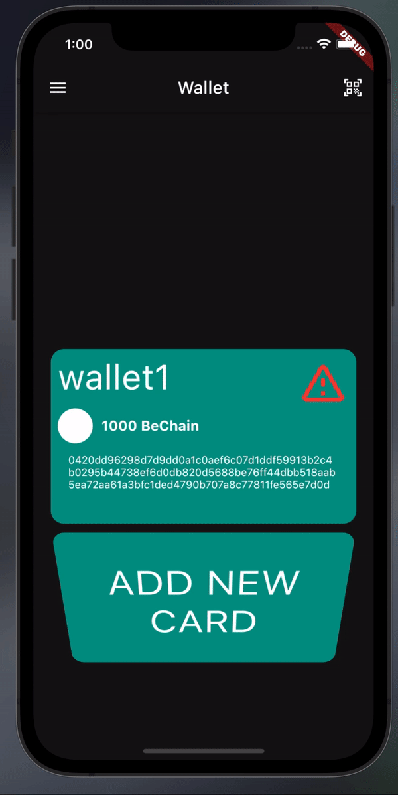
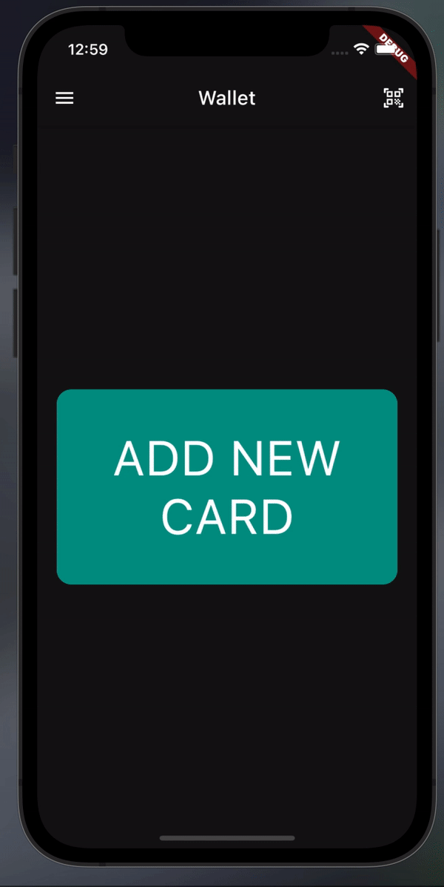
## Mockups

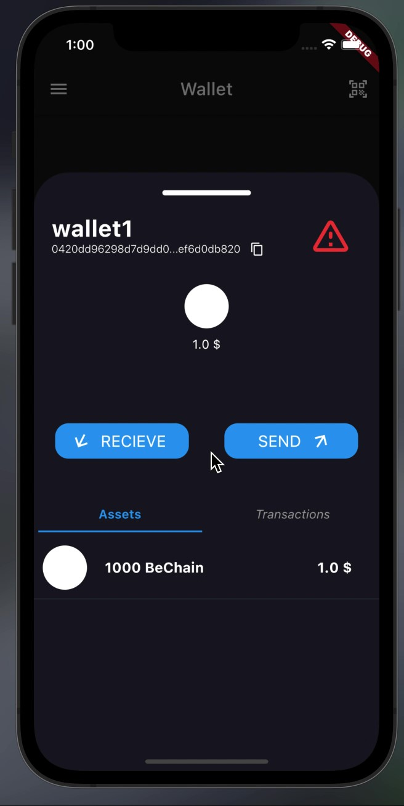
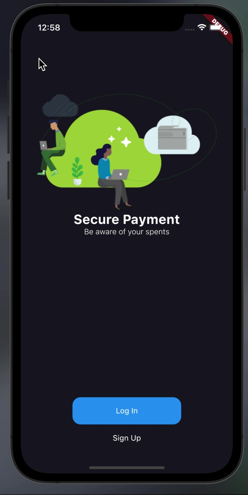
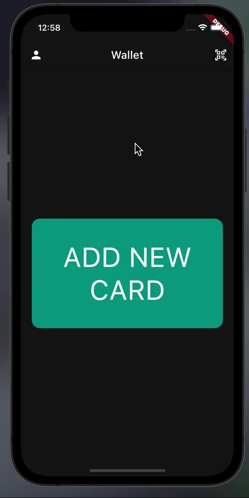
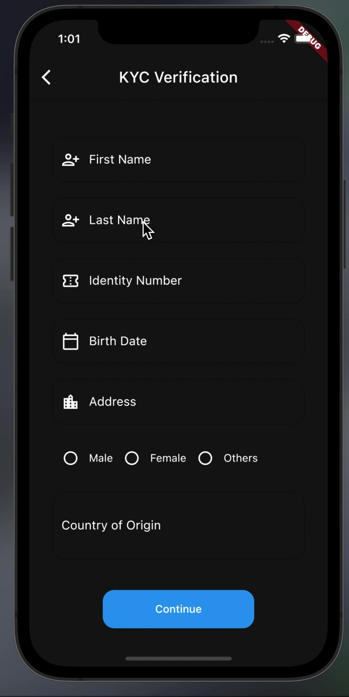
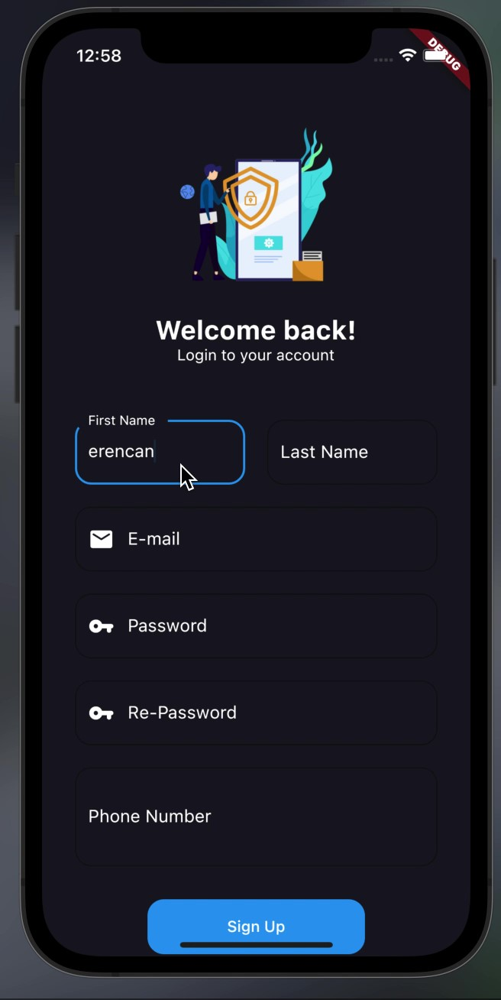
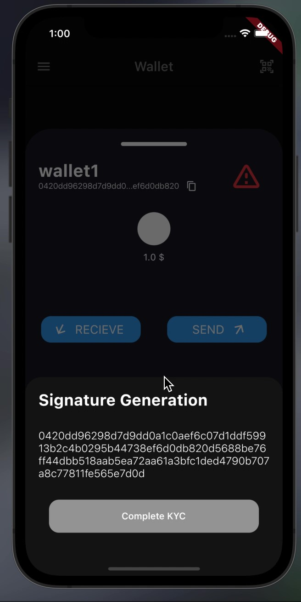
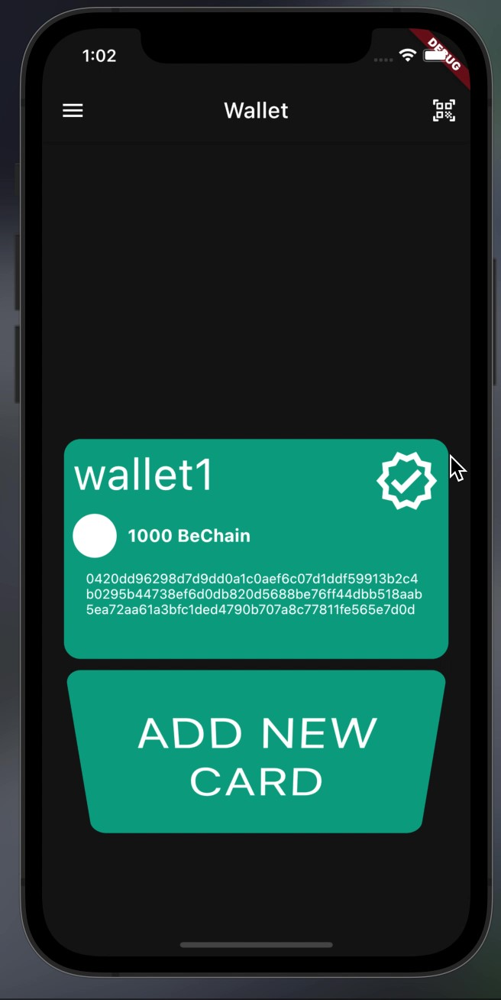
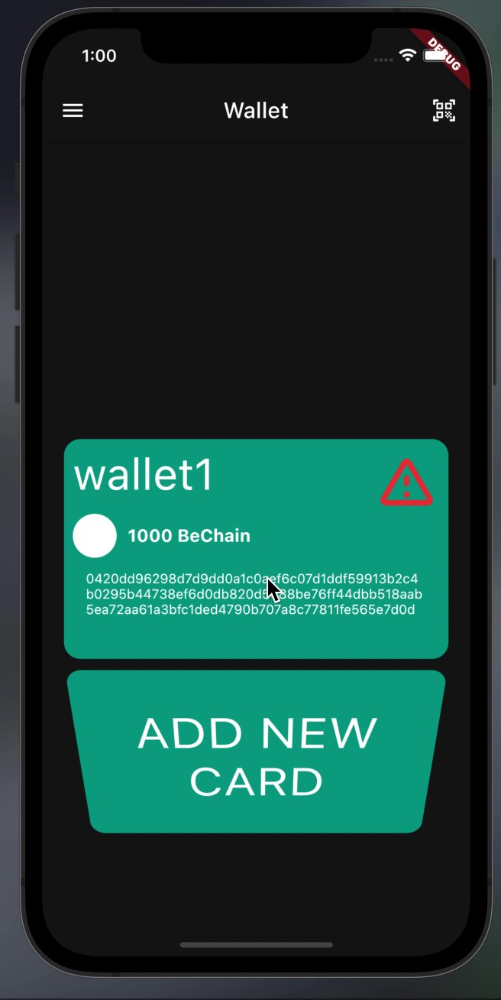
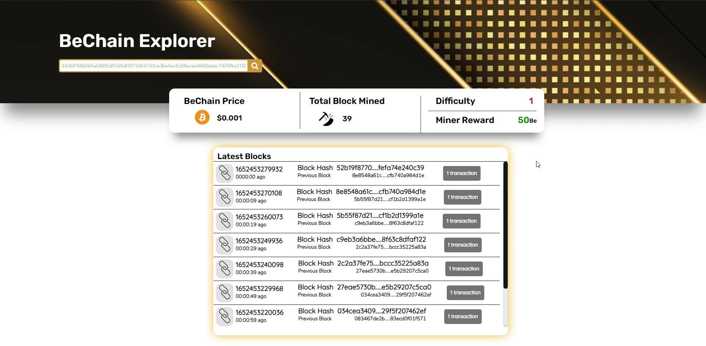

  
## Developers

- [@ErencanErel](https://github.com/erenJan) thanks for front-end.
- [@BerkayÜlgentürk](https://github.com/JustNormalUser) thanks for back-end.

  
